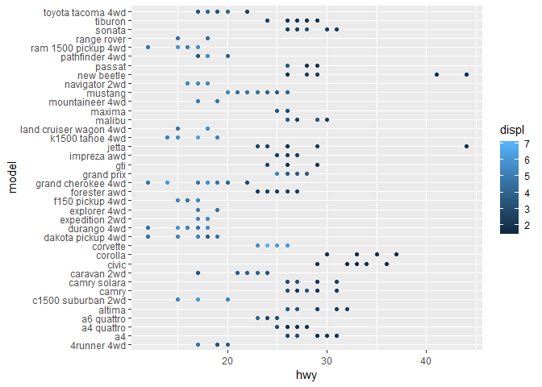
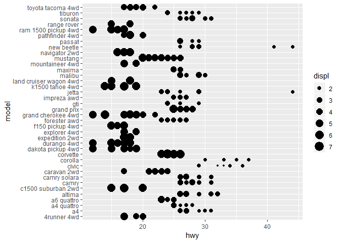
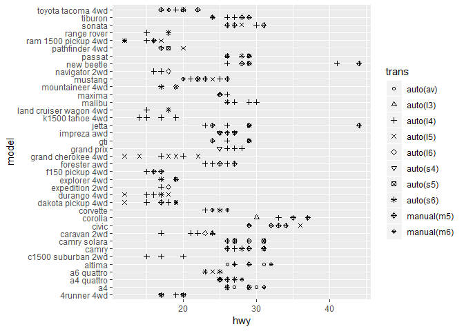
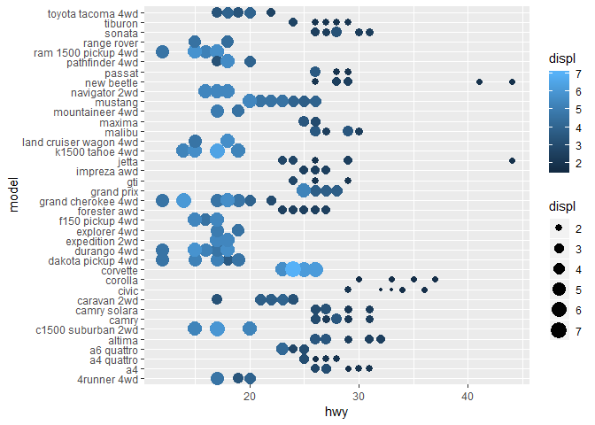
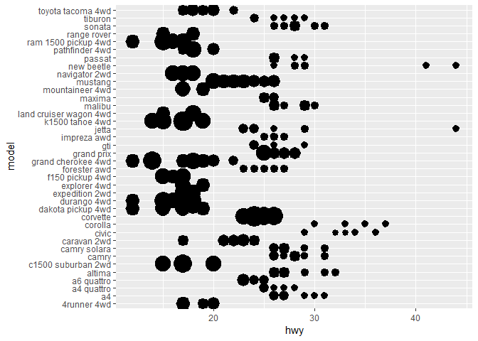
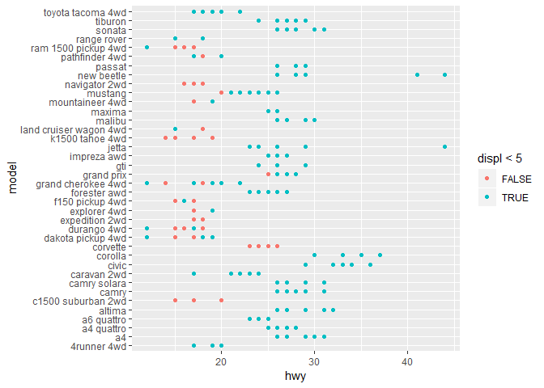

Homework 1: ggplot2
================
Your Name
2019-03-04

``` r
library(ggplot2)
```

By using *mpg* dataset:

1.  Map a continuous variable to color, size, and shape. How do these aesthetics behave differently for categorical vs. continuous variables?

-   Color

``` r
ggplot(data = mpg) +
  geom_point(mapping = aes(x = hwy, y = model, color = displ))
```



-   Size

``` r
ggplot(data = mpg) +
  geom_point(mapping = aes(x = hwy, y = model, size = displ))
```



-   Shape

``` r
ggplot(data = mpg) +
  geom_point(mapping = aes(x = hwy, y = model, shape = trans))+
  scale_shape_manual(values = 1:10)
```



1.  What happens if you map the same variable to multiple aesthetics?

``` r
ggplot(data = mpg) +
  geom_point(mapping = aes(x = hwy, y = model, color = displ, size = displ))
```



1.  What does the stroke aesthetic do? What shapes does it work with? (Hint: use ?geom\_point)

``` r
ggplot(data = mpg) +
  geom_point(mapping = aes(x = hwy, y = model, stroke = displ))
```



1.  What happens if you map an aesthetic to something other than a variable name, like aes(colour = displ &lt; 5)?

``` r
ggplot(data = mpg) +
  geom_point(mapping = aes(x = hwy, y = model, color = displ < 5))
```


